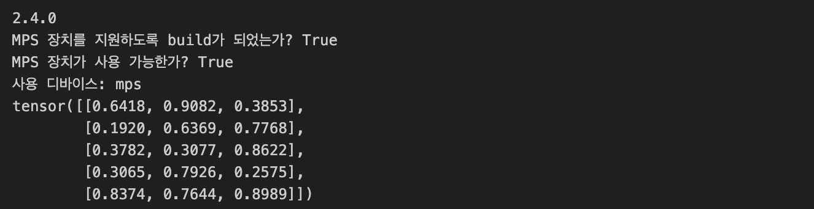

# PyTorch 기초

이 문서는 PyTorch의 기본적인 사용법과 텐서(Tensor) 조작 방법에 대해 설명합니다. PyTorch는 딥러닝 모델을 구축하고 훈련하는 데 매우 유용한 도구입니다.

## PyTorch 설치 확인

PyTorch가 올바르게 설치되었는지 확인하고, MPS 장치가 지원되는지 확인합니다.

```python
import torch

print(torch.__version__)
print(f"MPS 장치를 지원하도록 build가 되었는가? {torch.backends.mps.is_built()}")
print(f"MPS 장치가 사용 가능한가? {torch.backends.mps.is_available()}")

# 디바이스 설정
device = torch.device("mps" if torch.backends.mps.is_available() else "cpu")
print(f"사용 디바이스: {device}")
```



## 텐서 생성

PyTorch에서 텐서를 생성하는 방법을 알아봅니다.

### 1. 스칼라(SCALAR)

스칼라는 단일 숫자를 나타내며, 차원이 0입니다.

```python
scalar = torch.tensor(7)
print(scalar)
print(scalar.ndim) # 스칼라의 차원
print(scalar.item()) # 스칼라의 값
```

### 2. 벡터(Vector)

벡터는 1차원 배열입니다.

```python
vector = torch.tensor([7, 7])
print(vector)
print(vector.ndim) # 벡터의 차원
print(vector.shape) # 벡터의 크기
```

### 3. 행렬(Matrix)

행렬은 2차원 배열입니다.

```python
MATRIX = torch.tensor([[7,8],
                       [9,10]])
print(MATRIX)
print(MATRIX.ndim) # 행렬의 차원
print(MATRIX[1])
print(MATRIX.shape) # 행렬의 크기
```

### 4. 텐서(TENSOR)

텐서는 다차원 배열입니다.

```python
TENSOR = torch.tensor([[[1,2,3,],
                        [3,6,9,],
                        [3,5,4]]])
print(TENSOR)
print(TENSOR.ndim) # 텐서의 차원
print(TENSOR.shape) # 텐서의 크기
print(TENSOR[0][0]) # 0번째 텐서의 0번째 요소
```

## 랜덤 텐서 생성

랜덤한 값을 가지는 텐서를 생성합니다.

```python
random_tensor = torch.rand(1, 3, 4)
print(random_tensor)
print(random_tensor.ndim) # 텐서의 차원
print(random_tensor.shape) # 텐서의 크기
```

## 제로와 원으로 구성된 텐서

모든 요소가 0 또는 1인 텐서를 생성합니다.

```python
zeros = torch.zeros(size=(3, 4))
ones = torch.ones(size=(3, 4))
```

## 텐서 데이터 타입

텐서의 데이터 타입을 설정하고 변환하는 방법을 알아봅니다.

```python
float_32_tensor = torch.tensor([3.0, 6.0, 9.0],
                               dtype=torch.float32,
                               device="mps",
                               requires_grad=False)
float_16_tensor = float_32_tensor.to(torch.half)
```

## 텐서 정보 얻기

텐서의 데이터 타입, 크기, 저장된 장치에 대한 정보를 얻습니다.

1. Tensors not data types - to do get datatype from a tensor, can use `tensor.dtype`
2. Tensors not device - to get shape from a tensor, can use `tensor.shape` or `tensor.size()`
3. Tensors not shape - to get device from a tensor, can use `tensor.device`

```python
some_tensor = torch.rand(3, 4)
print(f"Datatype of tensor: {some_tensor.dtype}")
print(f"Shape of tensor: {some_tensor.size()}")
print(f"Device tensor is stored on: {some_tensor.device}")
```

## 텐서 연산

텐서에 대한 기본적인 연산을 수행합니다.

### 덧셈, 뺄셈, 곱셈

```python
tensor = torch.tensor([1, 2, 3])
print(tensor + 10)
print(tensor - 10)
print(tensor * 10)
```

### 행렬 곱셈

행렬 곱셈을 수행합니다.

```python
print(torch.matmul(tensor, tensor))
```
